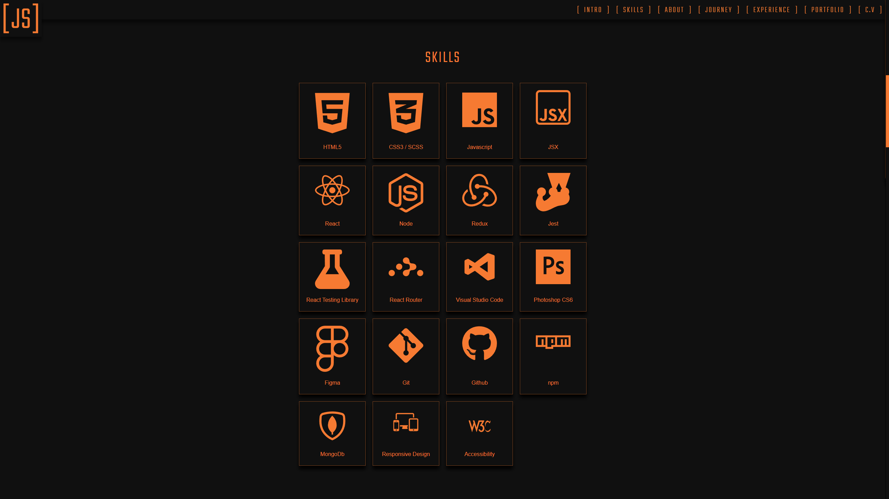
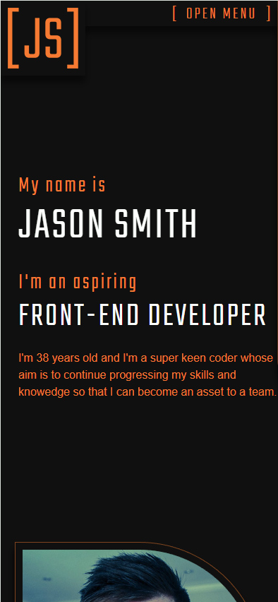

# Portfolio V.2

👋 Hi, I’m @Jason-Smith-Code

👀 I’m interested in

- Programming (Javascript)
- Gaming ( RTS, FPS & ARPG's)

📫 How to reach me
https://www.linkedin.com/in/jason-smith-code/

## Application Description

In version 2, I decided to convert the project into a react application as I wanted to use this library to filter porfolio items on the frontend without page reload.
This will be done at a later date once I have created enough projects to require such a feature.
It's also great for me to continue to use React for practice. 

## Objective

After seeking and receiving constructive feedback on my portfolio site, a few opinions were shared among viewers. I considered the logic behind their opinions and decided to take action on certain sections of the site.
Remove the animated skill bars and replace with icons and names of skills. Remove the portfolio slider and come up with a solution which allows a viewer to see basic information on a portfolio item without having to scroll on mobile.
Previously the container which held the portfolio item data, was larger than a mobile screen. 

## What was my Workflow

- **✅ Get feedbackon my current portfolio version**  
  Join several social media groups, made some posts with a direct link to the site.
- **✅ Analyse feedback, consider the opinions**  
- **✅ Make a copy of skills section**  
- **✅ Rebuild skill section**  
- **✅ Make a copy of portfolio section**  
- **✅ Rebuild portfolio section**  
- **✅ Uninstall any associated dependancies for the removed section**  
- **✅ Create SCSS for new components**  
- **✅ Remove SCSS for old components**  
- **✅ Run build**  
- **✅ Publish content**  

## Screen Shots

Desktop  
 

Mobile  

## Viewing the application

Visit : https://jason-smith.tech

## Project status

Currently the project is at version 1.0.0
